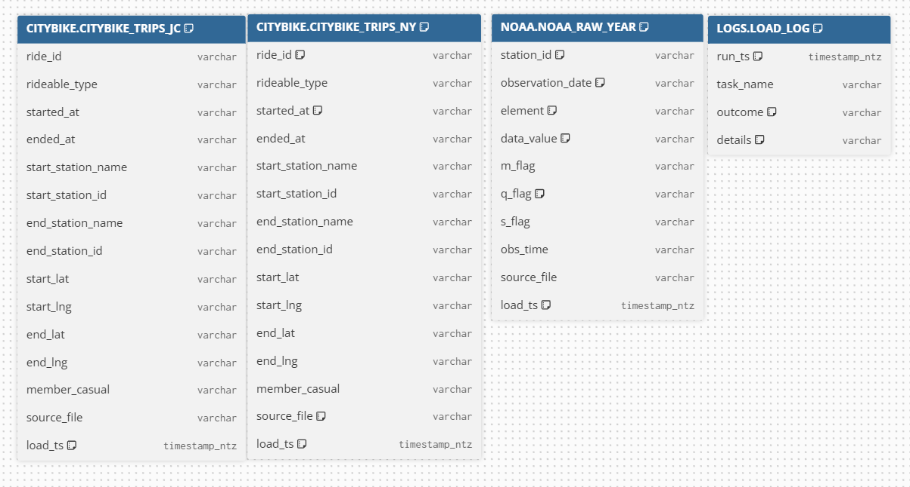
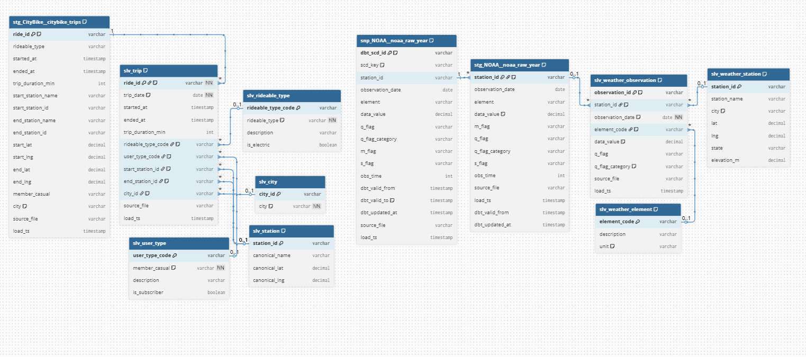
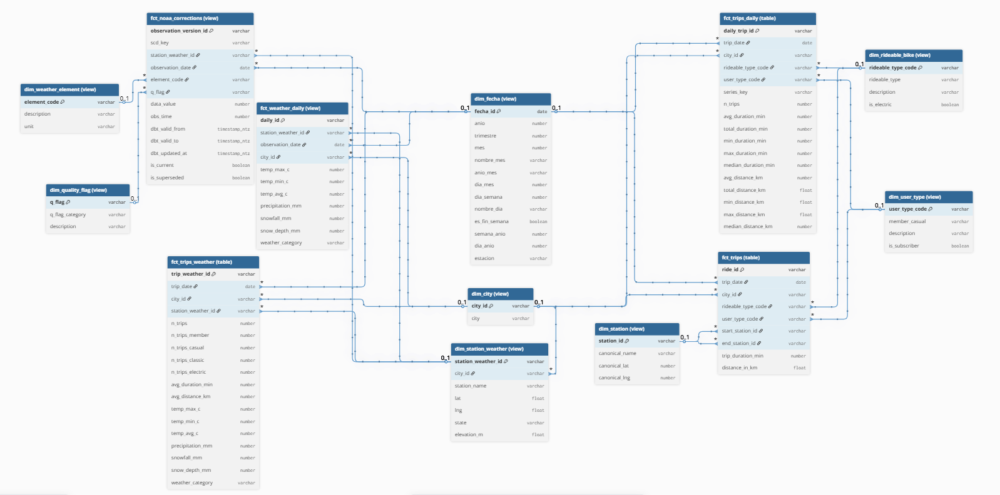

# Snowflake_proyect

Pipeline medallion (Bronze → Silver → Gold) sobre **Citi Bike NY + Jersey City + NOAA GHCN-Daily** en Snowflake, transformaciones con **dbt** (incluido snapshot SCD2 para correcciones NOAA), consumo final desde **Power BI** y soporte para forecasting con **Snowflake Cortex `ML.FORECAST`**.

## Diagramas

ERDs de Bronze, Silver y Gold.

- [`Snowflake_proyect/photos/Bronze.png`](Snowflake_proyect\photos\Bronze.png)
- [`Snowflake_proyect/photos/Silver.png`](Snowflake_proyect\photos\Silver.png)
- [`Snowflake_proyect/photos/Gold.png`](Snowflake_proyect\photos\Gold.png)

| Capa   |                Diagrama                   |              Capturas            |
|--------|-------------------------------------------|----------------------------------|
| Bronze | ver `Snowflake_proyect/photos/Bronze.png` |  |
| Silver | ver `Snowflake_proyect/photos/Silver.png` |  |
| Gold   | ver `Snowflake_proyect/photos/Gold.png`   |      |

Los `.dbml` en `photos/` se pegan tal cual en https://dbdiagram.io. El sufijo `(table)` o `(view)` del nombre indica la materializacion dbt — solo aparece en el diagrama.

## Stack

- **Snowflake** — almacenamiento, COPY INTO, Streams + Tasks para orquestación bronze.
- **Python** — descarga incremental de archivos Citi Bike desde S3 público y `PUT` a stages internos (JC siempre, NY desde 202604 por cambio de formato).
- **dbt 1.12** — staging, silver normalizado, snapshot SCD2 NOAA, marts gold star schema.
- **Power BI** — dashboards (consume Gold).
- **Cortex `ML.FORECAST`** — predicción de viajes futuros sobre `fct_trips_daily`.

## Arquitectura

```
BRONZE  ({DEV|PRO}_CITYBIKE_BRONZE)            SILVER  ({DEV|PRO}_CITYBIKE_SILVER)           GOLD  ({DEV|PRO}_CITYBIKE_GOLD)
─────────────────────────────────              ──────────────────────────────────            ──────────────────────────────
CITYBIKE.CITYBIKE_TRIPS_NY                     intermediate.stg_CityBike__citybike_trips     CORE.dim_fecha             (table)
   ↑ COPY S3 publico (2024-202603)                ↑ cast + union NY/JC + dedupe + filter     CORE.dim_city              (table)
   ↑ COPY stage interno (202604+)                                                            CORE.dim_user_type         (table)
CITYBIKE.CITYBIKE_TRIPS_JC                     CITYBIKE.slv_trip          (table, incr.)     CORE.dim_rideable_bike     (table)
   ↑ COPY stage interno (Python PUT)           CITYBIKE.slv_station       (table)            CORE.dim_station           (table)
                                               CITYBIKE.slv_city          (table)            CORE.dim_station_weather   (table)
NOAA.NOAA_RAW_YEAR                             CITYBIKE.slv_rideable_type (table)            CORE.dim_weather_element   (table)
   ↑ COPY S3 NOAA (by_year)                    CITYBIKE.slv_user_type     (table)            CORE.dim_quality_flag      (table)

                                               snapshots.snp_NOAA__noaa_raw_year (SCD2)      MARTS.fct_trips            (table, incr. + cluster)
                                                  ↑ check_cols=[data_value, q_flag_cat]      MARTS.fct_trips_daily      (table, incr.)
                                                                                             MARTS.fct_trips_weather    (table, incr.)
                                               intermediate.stg_NOAA__noaa_raw_year          MARTS.fct_weather_daily    (table, incr.)
                                                  ↑ view sobre version vigente del SCD2      MARTS.fct_noaa_corrections (table + cluster)
                                               NOAA.slv_weather_observation (view)
                                               NOAA.slv_weather_station    (table)
                                               NOAA.slv_weather_element    (view)
                                               NOAA.slv_quality_flag       (view, lookup)
```

## Bronze

Tablas raw en VARCHAR para preservar el dato original.

| Tabla | Origen | Cron de carga | Procedure |
|---|---|---|---|
| `CITYBIKE_TRIPS_NY` | S3 público `s3://tripdata` (2024-01..2026-03) + stage interno `CITYBIKE_LANDING_STAGE_NY` (2026-04+) | día 28 03:00 NY | `LOAD_CITYBIKE_NY()` + `LOAD_CITYBIKE_NY_INT()` |
| `CITYBIKE_TRIPS_JC` | Stage interno `CITYBIKE_LANDING_STAGE` (upload Python) | día 28 03:00 NY | `LOAD_CITYBIKE_JC()` |
| `NOAA_RAW_YEAR` | S3 público `s3://noaa-ghcn-pds/csv.gz/by_year/` | después de las chains de Citi Bike (AFTER + WHEN stream) | `LOAD_NOAA_YEAR()` |

**¿Por qué dos paths para NY?** Citi Bike cambió formato a partir de 202604 y los archivos del bucket público están parcialmente corruptos. El script Python descarga el zip, lo extrae y `PUT` al stage interno limpio. El task del bucket público sigue activo para 2024-202603 (datos cerrados, sin cambio de formato).

**¿Por qué día 28?** Citi Bike publica el mes M durante el mes M+1. El día 28 garantiza que el mes anterior ya cerró y no llegarán partes nuevas corruptas.

## Snapshot SCD2 — `snp_NOAA__noaa_raw_year`

NOAA reescribe archivos del año cuando publica correcciones de `q_flag` o `data_value`. El snapshot captura todas las versiones históricas con strategy `check` sobre `[data_value, q_flag_category]`.

`scd_key` = `upper(trim(station_id)) || '|' || trim(observation_date) || '|' || upper(trim(element))`. Dedupe explícito en CTE intermedia (no qualify final) para que el primer run no inserte filas duplicadas.

El snapshot guarda `q_flag` (raw) y `q_flag_category` (derivada inline, necesaria para SCD2 `check_cols`). Las columnas `m_flag` y `s_flag` no se exponen — no aportan a historia ni a BI.

`fct_noaa_corrections` (gold) expone TODAS las versiones para BI: `is_current`, `is_superseded`. La categoria del flag se resuelve via FK a `dim_quality_flag` (lookup normalizado), no como columna inline.

## Silver

`stg_CityBike__citybike_trips` — incremental MERGE por `ride_id`. Solo cast + clean + dedupe. Union NY+JC, cast a tipos correctos, filter por timestamps válidos / station_id válido / rideable_type ∈ (classic, electric) / member_casual ∈ (member, casual), bounding box NY/NJ (`lat ∈ [40.4, 41]`, `lng ∈ [-75, -73]`) para descartar stations demo fuera del area, dedupe intra-batch. Sin enrichment — `trip_duration_min` y `distance_in_km` se calculan en silver.

`stg_NOAA__noaa_raw_year` — view delgada sobre el snapshot, filtra `dbt_valid_to is null` (versión vigente).

`slv_trip` — fact normalizado, `table` incremental MERGE por `ride_id` con ventana `load_ts > max(load_ts)`. Aplica enrichment: `trip_duration_min` via `datediff` y `distance_in_km` via `ST_DISTANCE` sobre las coords canónicas que vienen del LEFT JOIN a `slv_station` (start + end). FKs surrogate a las dims via `dbt_utils.generate_surrogate_key`. ~100M filas.

`slv_station`, `slv_city`, `slv_rideable_type`, `slv_user_type` — `table` (override sobre el default `view` del silver). Hacen `select distinct` o `row_number` sobre `slv_trip`/`stg_CityBike`; materializar evita full-scan en cada query downstream.

`slv_weather_station` — `table`. Join entre seed `weather_station_us` y `stg_NOAA` para filtrar a estaciones activas.

`slv_weather_observation`, `slv_weather_element`, `slv_quality_flag` — `view`. El fact long es passthrough; los lookups son hardcoded estáticos. Sin computación, no se beneficia de table.

`slv_quality_flag` — lookup `(q_flag, q_flag_category, description)`. Cualquier modelo que necesite la categoría del flag hace JOIN aquí.

## Gold

### `marts/core/` (dimensiones, schema `CORE`)

Todas las dims son `table` con `contract: { enforced: true }` y constraints PK / NOT NULL a nivel tabla.

| Dim | Source | Notas |
|---|---|---|
| `dim_fecha` | `dbt_utils.date_spine` + `run_query` sobre min/max de `stg_NOAA__noaa_raw_year` | PK = `fecha_id` (DATE). El rango se ancla a NOAA porque NOAA se actualiza por trigger de NY/JC. Columnas en español: anio, trimestre, mes, nombre_mes, anio_mes, dia_mes, dia_semana, nombre_dia, es_fin_semana, semana_anio, dia_anio, estacion. |
| `dim_city` | passthrough `slv_city` | Manhattan, Jersey City |
| `dim_user_type` | passthrough `slv_user_type` | member, casual |
| `dim_rideable_bike` | passthrough `slv_rideable_type` | classic, electric |
| `dim_station` | passthrough `slv_station` | ~2000 estaciones Citi Bike |
| `dim_station_weather` | passthrough `slv_weather_station` | 2 estaciones NOAA del proyecto |
| `dim_weather_element` | passthrough `slv_weather_element` | TMAX, TMIN, PRCP, SNOW, SNWD, AWND, WSF2, WSF5 |
| `dim_quality_flag` | passthrough `slv_quality_flag` | Lookup q_flag NOAA → q_flag_category |

### `marts/` (facts, schema `MARTS`)

Toda Gold es `table` (con contracts + constraints). Los facts con datos que crecen acumulativamente son `incremental MERGE`. Los lookups y aggregates con datos que mutan en bloque (`fct_noaa_corrections`) son `table` full refresh.

| Fact | Grano | Material. | Notas |
|---|---|---|---|
| `fct_trips` | 1 row/viaje | incremental MERGE + `cluster_by=year(trip_date)` | Passthrough de `slv_trip` con FKs a dims. ~100M filas. Cluster por año porque Power BI filtra historial por fecha. |
| `fct_trips_daily` | `trip_date × city × bike × user` | incremental MERGE | Métricas: `n_trips`, `avg/sum/min/max/median duration`. Incluye `series_key` listo para `ML.FORECAST`. |
| `fct_trips_weather` | `trip_date × city` | incremental MERGE | Cruza trips agregados (`n_trips_member/casual/classic/electric`) con clima (`temp_max/min/avg_c`, `precipitation_mm`, `snow_mm`, `weather_category`). Mapeo Manhattan→`USW00094728`, JC→`USW00014734`. |
| `fct_weather_daily` | `(station, observation_date)` | incremental MERGE | Pivot wide de elementos NOAA + `weather_category` (rainy/snowy/hot/cold/mild). Ventana 7 días sobre `observation_date`. |
| `fct_noaa_corrections` | 1 row/versión SCD2 | table (full refresh) + `cluster_by=year(observation_date)` | Toda la historia del snapshot. `is_current`, `is_superseded`. Full refresh para reflejar siempre el snapshot al 100% (incluye correcciones a años antiguos). |

Los aggregados (`fct_trips_daily`, `fct_trips_weather`, `fct_weather_daily`) usan ventana incremental de **7 días** para absorber late-arriving data. Para reprocesar correcciones NOAA en historia profunda: `dbt run --full-refresh --select fct_trips_weather fct_weather_daily`.

## Contracts y constraints

**Política:** todas las tablas materializadas como `table` (incluyendo incremental) llevan `contract: { enforced: true }` y `constraints:` (PK + NOT NULL) a nivel tabla.

| Modelo | Capa | PK |
|---|---|---|
| `slv_trip` | Silver | `ride_id` |
| `fct_trips` | Gold CORE | `ride_id` |
| `fct_trips_daily` | Gold MARTS | `daily_trip_id` |
| `fct_trips_weather` | Gold MARTS | `trip_weather_id` |
| `fct_weather_daily` | Gold CORE | `daily_id` |
| `fct_noaa_corrections` | Gold MARTS | `observation_version_id` |
| `dim_*` (8 dims) | Gold CORE | varias |

Snowflake solo enforce `NOT NULL`; `PRIMARY KEY` / `FOREIGN KEY` son informativas. La unicidad real se valida con `data_tests`.

## Tests

Política: testear donde la constraint **se establece** o se puede romper, **no repetir** tests upstream.

- **Sources** — `source_file` y `load_ts` `not_null` (catch fallo de COPY). `ride_id not_null` como warn. La basura del CSV se filtra en stg.
- **stg** — primera capa con validación de contenido: `unique`/`not_null` en PKs, `accepted_values` en categóricos.
- **Silver** — solo lo que se establece aquí: PKs surrogate generadas (`slv_city`, `slv_rideable_type`, `slv_user_type`), FKs intra-silver y a `dim_fecha` (`slv_trip`, `slv_weather_observation`), accepted_values donde se clasifica por primera vez (`slv_weather_element.unit`, `slv_quality_flag.q_flag_category`).
- **Snapshot** — `unique(dbt_scd_id)`, `not_null(scd_key)`, `accepted_values(q_flag_category)`.
- **Gold** — surrogate PKs nuevas (`daily_trip_id`, `trip_weather_id`, `daily_id`, `observation_version_id`, `fecha_id`); FKs creadas por joins nuevos a nivel gold (`fct_trips_weather.station_weather_id → dim_station_weather`); accepted_values calculados en gold (`fct_weather_daily.weather_category`).
- **Singulares** — `test_citybike_no_silent_drop`, `test_citybike_partial_month_detection`, `test_noaa_element_count_match`, `test_noaa_station_count_match`, `test_weather_station_count_match`.

## Schema DEV/PRO

`macros/generate_schema_name.sql` decide el layout según `DBT_ENVIRONMENTS`:

- **DEV** → `{target.schema}_{custom_schema}` (sandbox personal: `dbt_rlizaran_intermediate`, `dbt_rlizaran_CORE`, etc.).
- **PRO** → `{custom_schema}` directo (`intermediate`, `CITYBIKE`, `NOAA`, `MARTS`, `CORE`).

`DBT_ENVIRONMENTS=DEV|PRO` también decide la database (`DEV_CITYBIKE_*` vs `PRO_CITYBIKE_*`) via `generate_database_name.sql` + env_var en `dbt_project.yml`.

Cada dev pone `SF_SCHEMA=dbt_<usuario>` para su sandbox.

## Orquestación Snowflake

Todos los streams y tasks viven en `DB_CITYBIKE_LOGS.{LOGS|PRO}`. DEV y PRO comparten la misma topología — `TSK_BRONZE_MASTER` es el único root con CRON, las 3 chains arrancan AFTER MASTER, y un drain final cierra el cycle.

```
                                    TSK_BRONZE_MASTER (cron 0 3 28 * * NY)
                                              │
                ┌─────────────────────────────┼─────────────────────────────┐
                ▼                             ▼                             ▼
   TSK_BRONZE_CITYBIKE_NY      TSK_BRONZE_NY_INT_REFRESH       TSK_BRONZE_JC_REFRESH
   (S3 publico 2024-202603)              │                              │
                │                        ▼ WHEN STM_NY_STAGE             ▼ WHEN STM_JC_STAGE
                │             TSK_BRONZE_NY_INT_ONFILES      TSK_BRONZE_JC_ONFILES
                │                        │                              │
                │                        ▼                              ▼
                │             TSK_BRONZE_NY_INT_DRAIN        TSK_BRONZE_JC_DRAIN
                │                        │                              │
                └────────────────────────┴──────────────────────────────┘
                                              ▼ WHEN STM_CITYBIKE_NY or STM_CITYBIKE_JC tiene datos
                                       TSK_BRONZE_NOAA
                                              │
                                              ▼
                                  TSK_BRONZE_CITYBIKE_STREAMS_DRAIN
                                  (drena STM_CITYBIKE_NY + STM_CITYBIKE_JC para cerrar cycle)
```

Los streams de stage (`STM_*_STAGE`) detectan archivos nuevos para que `WHEN` arranque `LOAD_*_INT()` solo si hay algo nuevo. Los `*_DRAIN` consumen el stream tras el COPY para que el `WHEN` del próximo cycle empiece limpio.

Los streams de tabla (`STM_CITYBIKE_NY`, `STM_CITYBIKE_JC`) detectan inserts en bronze para que `WHEN` arranque NOAA. Se drenan al final del cycle con `TSK_BRONZE_CITYBIKE_STREAMS_DRAIN` para que el próximo cycle también arranque limpio.

## Jobs dbt recomendados (PRO)

| Job | Comando | Schedule |
|---|---|---|
| **Build mensual** | `dbt build` | día 28, ~05:00 NY (tras NOAA del task chain) |
| **Full refresh trimestral** | `dbt build --full-refresh` | primer día 28 del trimestre, ~06:00 NY |
| **Source freshness diario** | `dbt source freshness` | diario ~09:00 NY |
| **Docs** (opcional) | `dbt docs generate` | tras el build mensual o el full refresh trimestral |

`dbt build` engloba snapshot → models → tests en orden DAG. Corta al primer error.

## ML.FORECAST (futuro)

`fct_trips_daily` tiene la forma necesaria:
- TIMESTAMP = `trip_date`
- TARGET = `n_trips`
- SERIES = `series_key` (concat `city_id|rideable_type_code|user_type_code` → 8 series)

Ejemplo:
```sql
CREATE OR REPLACE SNOWFLAKE.ML.FORECAST forecast_trips_30d(
    INPUT_DATA       => TABLE(PRO_CITYBIKE_GOLD.MARTS.FCT_TRIPS_DAILY),
    SERIES_COLNAME   => 'series_key',
    TIMESTAMP_COLNAME=> 'trip_date',
    TARGET_COLNAME   => 'n_trips'
);
CALL forecast_trips_30d!FORECAST(FORECASTING_PERIODS => 30);
```

Si se necesita meter exógenas (temp, prcp) se pasa a un modelo Python en dbt (`materialized='python'`).

## Estructura del repo

```
Snowflake_proyect/
├── .gitignore
├── README.md
├── dbt_project.yml                          # config dbt (DBs por env, schemas por capa)
├── profiles.yml                             # perfil Snowflake (env vars)
├── packages.yml                             # dbt_utils, codegen, dbt_expectations, dbt_date
├── package-lock.yml
├── requirements.txt
│
├── _python_scripts/
│   ├── extract_jc_to_stage.py               # ingestor idempotente JC + NY (202604+) -> stages internos
│   └── us_state_weather.py                  # generador del seed weather_station_us.csv
│
├── analyses/                                # vacio (placeholder dbt)
│
├── macros/
│   ├── bronze_silver_count_diff.sql         # macro test bronze vs silver
│   ├── generate_database_name.sql           # nombre EXACTO de DB segun env
│   └── generate_schema_name.sql             # DEV={target}_{custom}; PRO={custom}
│
├── seeds/
│   ├── _seeds.yml
│   └── weather_station_us.csv               # lookup de estaciones NOAA
│
├── snapshots/
│   ├── _snapshot.yml
│   └── snp_NOAA__noaa_raw_year.sql          # SCD2 sobre NOAA
│
├── models/
│   ├── staging/
│   │   ├── intermediate/
│   │   │   ├── __stg_citybike__source.yml
│   │   │   ├── __stg_NOAA__source.yml
│   │   │   ├── stg_CityBike__citybike_trips.sql   # union NY+JC incr. MERGE
│   │   │   └── stg_NOAA__noaa_raw_year.sql        # view sobre snapshot vigente
│   │   └── silver/
│   │       ├── CityBike/
│   │       │   ├── _stg_CityBike__model.yml
│   │       │   ├── slv_city.sql                    # table
│   │       │   ├── slv_rideable_type.sql           # table
│   │       │   ├── slv_station.sql                 # table
│   │       │   ├── slv_trip.sql                    # table incremental MERGE
│   │       │   └── slv_user_type.sql               # table
│   │       └── NOAA/
│   │           ├── _stg_NOAA__model.yml
│   │           ├── slv_quality_flag.sql            # lookup q_flag -> categoria
│   │           ├── slv_weather_element.sql         # view
│   │           ├── slv_weather_observation.sql     # view (fact long)
│   │           └── slv_weather_station.sql         # table
│   └── marts/
│       ├── _marts__model.yml
│       ├── fct_noaa_corrections.sql                # table + cluster year(observation_date)
│       ├── fct_trips_daily.sql                     # table incr.
│       ├── fct_trips_weather.sql                   # table incr.
│       └── core/
│           ├── _core__model.yml
│           ├── dim_city.sql
│           ├── dim_fecha.sql                       # date_spine anclado a NOAA
│           ├── dim_quality_flag.sql                # passthrough slv_quality_flag
│           ├── dim_rideable_bike.sql
│           ├── dim_station.sql
│           ├── dim_station_weather.sql
│           ├── dim_user_type.sql
│           ├── dim_weather_element.sql
│           ├── fct_trips.sql                       # table incr. + cluster year(trip_date)
│           └── fct_weather_daily.sql               # table incr.
│
├── tests/
│   └── singular/
│       ├── test_citybike_no_silent_drop.sql
│       ├── test_citybike_partial_month_detection.sql
│       ├── test_noaa_element_count_match.sql
│       ├── test_noaa_station_count_match.sql
│       └── test_weather_station_count_match.sql
│
├── photos/                                  # ERDs
│   ├── Bronze.png
│   ├── Silver.png
│   ├── Gold.png
│   ├── silver.dbml
│   └── gold.dbml
│
└── __Snowflake/                             # SQL aplicado en Snowflake (no toca dbt)
    ├── ROLS/
    │   └── Rol.sql
    ├── DEV/
    │   ├── SETUP/
    │   │   └── Set Up Inicial.sql
    │   └── BRONZE/
    │       ├── GITHUB + STAGES/
    │       │   ├── Github Integration.sql
    │       │   ├── Github Secret.sql
    │       │   └── Stages + FileFormat.sql
    │       ├── ROOT LAYER.sql               # tablas raw + procedures (load, refresh, drain)
    │       ├── Tasks + Streams.sql          # streams + chains + MASTER
    │       ├── Task Control.sql
    │       └── Verify steps.sql
    ├── PRO/
    │   └── BRONZE/
    │       ├── Stages + FileFromat.sql
    │       ├── Table + Procedure.sql
    │       ├── Task + Streams in PRO.sql    # streams + chains + MASTER
    │       └── Task Control.sql
    └── DEMO/
        ├── DEMO.md
        ├── demo_01_inject.sql
        └── demo_02_verify.sql
```

## Setup rápido

```bash
# variables de entorno (snowflake + selector DEV/PRO)
cp .env.example .env  # editar credenciales + DBT_ENVIRONMENTS=DEV + SF_SCHEMA=dbt_<usuario>

# Python ingestor (sube JC + NY 202604+)
pip install -r requirements.txt
python _python_scripts/extract_jc_to_stage.py

# dbt
dbt deps
dbt build
```

Orden SQL Snowflake (una sola vez por entorno):
`Set Up Inicial → Rol → Github Secret → Github Integration → Stages + FileFormat → ROOT LAYER → Tasks + Streams → Task Control`

## Idempotencia y resiliencia

- **Python** — compara contra `LS @stage` y solo sube meses faltantes; OVERWRITE=TRUE para reintento limpio.
- **COPY INTO** — load metadata evita reingesta (`FORCE=FALSE`).
- **`ON_ERROR='CONTINUE'`** — un archivo malo no rompe el batch.
- **Snapshot SCD2** — NOAA corrige histórico; el snapshot lo captura sin perder versiones.
- **Incremental MERGE en silver/marts** — solo procesa rows nuevos o de la ventana de backfill.
- **Stage stream drain JC/NY** — evita que el `WHEN` quede TRUE indefinido entre ciclos.
- **Table stream drain final** — `TSK_BRONZE_CITYBIKE_STREAMS_DRAIN` consume `STM_CITYBIKE_NY` y `STM_CITYBIKE_JC` para que el siguiente cycle vuelva a evaluar el `WHEN` de NOAA en limpio.
- **Logging** — todo procedure escribe en `DB_CITYBIKE_LOGS.{LOGS|PRO}.LOAD_LOG`.

## Jobs dbt en PRO

| Job | Comando | Schedule | Propósito |
|---|---|---|---|
| **Build mensual** | `dbt build && dbt docs generate` | día 28 ~05:00 NY | Pipeline normal post-bronze |
| **Source freshness diario** | `dbt source freshness` | diario ~09:00 NY | Alerta de bronze stale |
| **Full refresh periódico** | `dbt build --full-refresh && dbt docs generate` | día 28 cada 3-6 meses ~06:00 NY | Catch correcciones NOAA profundas |

### Razones

**Build mensual** — corre después del task chain de Snowflake (`TSK_BRONZE_MASTER` día 28 03:00 NY → NY S3 + NY interno + JC + NOAA + streams drain → ~04:00 finaliza). Ejecuta snapshot → models incrementales → tests → docs en orden DAG. Es el único job que transforma datos en cadencia normal. Más frecuencia es desperdicio porque bronze solo se refresca día 28.

**Source freshness diario** — independiente del build, lee solo `MAX(load_ts)` de los sources contra `warn_after 30d / error_after 40d`. Ejecución de ~10 segundos, casi gratis. Te enteras enseguida si un task de Snowflake falló en silencio y bronze quedó stale, sin esperar al día 28.

**Full refresh trimestral o semestral** — los aggregates `fct_trips_daily`, `fct_trips_weather` y `fct_weather_daily` usan ventana incremental de **7 días**. Si NOAA publica correcciones SCD2 más allá de esa ventana, los aggregates no se actualizan automáticamente. El `--full-refresh` reconstruye los modelos incrementales desde cero, captura esas correcciones y limpia cualquier drift acumulado. El snapshot SCD2 no se borra (dbt lo protege del full-refresh por diseño) — solo se rebuildean los models downstream.

### Notas operativas

- Encadenar `dbt docs generate` al **success** del build (no como job separado). Si falla el build, no generas docs de un estado roto.
- En **dbt Cloud**: los 3 jobs apuntan al mismo deployment environment (`PRO`), diferentes comandos + cron.
- En **GitHub Actions / cron externo**: 3 workflows separados con la misma imagen dbt y env vars (`DBT_ENVIRONMENTS=PRO`, `SF_*`).
