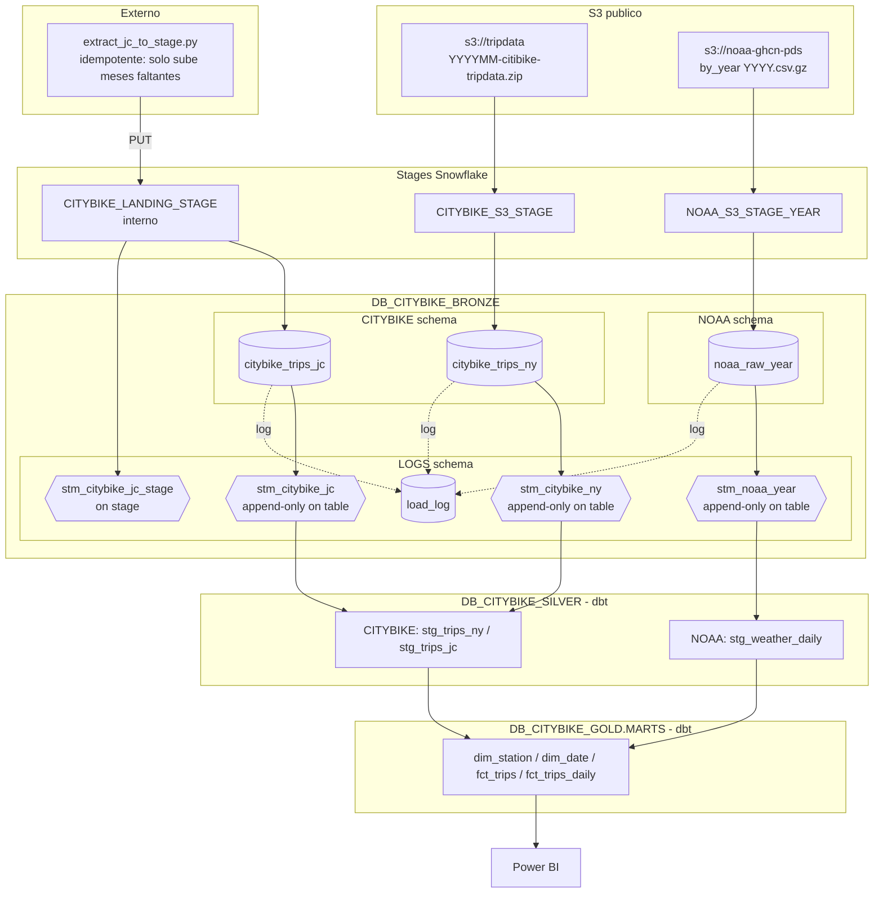
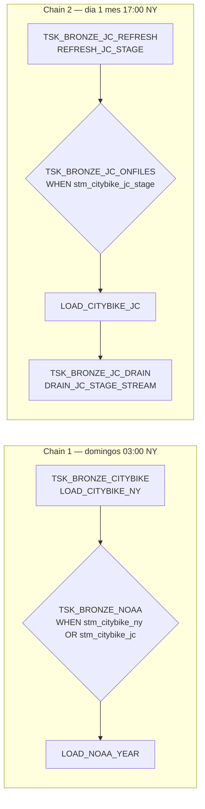

# Snowflake_proyect

Pipeline medallion (Bronze → Silver → Gold) sobre **Citi Bike NYC + Jersey City + NOAA** en Snowflake, con transformaciones en dbt y consumo final desde Power BI.

## Stack

- **Snowflake** — ingesta, almacenamiento, orquestación (Tasks + Streams).
- **Python** — descarga incremental de archivos JC desde S3 público y `PUT` al stage interno.
- **dbt** — transformaciones Silver y Gold.
- **Power BI** — dashboards.

## Arquitectura



## Orquestación de Tasks

Todos los tasks viven en `DB_CITYBIKE_BRONZE.LOGS` (mismo schema requerido por el DAG de Snowflake).



Antes de Chain 2 corre el script Python (Task Scheduler / GitHub Actions) que sube al landing los meses JC faltantes.

## Flujo end-to-end

1. **Setup** — `WH_NYCBIKE_DEV`, 3 DBs medallion `DB_CITYBIKE_BRONZE` / `DB_CITYBIKE_SILVER` / `DB_CITYBIKE_GOLD`. Schemas: Bronze tiene `LOGS`, `CITYBIKE`, `NOAA`; Silver tiene `CITYBIKE`, `NOAA`; Gold tiene `MARTS`. Rol `ROLE_NYCBIKE`, integración Git para versionar SQL.
2. **Stages** — externos a S3 público (NY, NOAA) e interno para JC.
3. **Ingesta NY** — semanal, COPY directo desde S3 con `PATTERN`.
4. **Ingesta JC** — Python idempotente sube los meses nuevos al landing → stream sobre stage detecta archivos → COPY → drain del stage stream.
5. **Ingesta NOAA** — condicional: solo si los streams de Citi Bike traen filas nuevas.
6. **Logging** — cada procedure escribe en `LOGS.LOAD_LOG` (rows, files, errores).
7. **Transformación** — dbt consume las tablas Bronze como sources y materializa Silver (`DB_CITYBIKE_SILVER.{CITYBIKE,NOAA}`) y Gold (`DB_CITYBIKE_GOLD.MARTS`).
8. **Consumo** — Power BI sobre la capa Gold.

## Estructura del repo

```
Snowflake_proyect/
├── extract_jc_to_stage.py        # ingestor idempotente JC → landing
├── .env.example                   # variables de conexion Snowflake
├── requirements.txt
├── dbt_project.yml                # config dbt: staging→SILVER.{CITYBIKE,NOAA}, marts→GOLD.MARTS
├── profiles.yml                   # perfil dbt (mover a ~/.dbt/ o usar DBT_PROFILES_DIR)
├── packages.yml                   # dependencias dbt
├── models/                        # modelos dbt
│   ├── staging/                   # se materializan en DB_CITYBIKE_SILVER (citybike/, noaa/)
│   └── marts/                     # se materializan en DB_CITYBIKE_GOLD.MARTS
└── Snowflake/
    ├── ROLS + SETUP/
    │   ├── Set Up Inicial.sql     # warehouses + 3 DBs + schemas
    │   └── Rol.sql                # ROLE_NYCBIKE + grants
    └── BRONZE/
        ├── GITHUB + STAGES/
        │   ├── Github Integration.sql
        │   ├── Github Secret.sql
        │   └── Stages + FileFormat.sql
        ├── ROOT LAYER.sql         # tablas, procedures, log
        ├── Tasks + Streams.sql    # streams + tasks encadenados
        ├── Task Control.sql       # RESUME / SUSPEND / EXECUTE
        └── Verify steps.sql       # checks de ingesta
```

## Idempotencia y resiliencia

- **Python** — compara contra `LS @stage` y solo sube los meses faltantes.
- **COPY INTO** — load metadata evita reingesta del mismo archivo (FORCE=FALSE por defecto).
- **`ON_ERROR='CONTINUE'`** — un archivo malo no rompe el batch.
- **EXCEPTION handlers** — cualquier error queda registrado en `LOGS.LOAD_LOG`.
- **Drain del stage stream JC** — evita que el `WHEN` quede permanentemente TRUE.

## Configuración rápida

```bash
cp .env.example .env
# editar credenciales
pip install -r requirements.txt
python extract_jc_to_stage.py
```

Orden de ejecución del SQL: `Set Up Inicial → Rol → Github Secret → Github Integration → Stages + FileFormat → ROOT LAYER → Tasks + Streams → Task Control`.
